# Database Security Analysis & Automated Data Pipeline


## Overview

A two-part practical project covering database security concepts and automated data collection.
Part one involves designing and querying a cybersecurity-domain relational database in SQL Server
Management Studio. Part two involves building a Python web scraping script to extract structured
data from a live website and export it to CSV automatically.

---

## Part 1 — Database Design & SQL Querying (SSMS)

### Database: CyberSecurityDB

A relational database designed around a cybersecurity operations context, with tables covering
departments, employees, systems, users, threats, vulnerabilities, incidents, security logs,
and security training records.

**Schema overview:**

| Table | Description |
|-------|-------------|
| Departments | Organisational departments |
| Employees | Staff records linked to departments |
| Systems | IT assets with criticality levels and ownership |
| Users | System accounts with access levels and password hashes |
| Threats | Threat catalogue (type, severity, description) |
| Vulnerabilities | Vulnerability records |
| Incidents | Security incident records |
| Incident_Threats | Junction table — incidents to threats |
| Security_Logs | Event and access logs |
| Security_Training | Employee training completion records |

### SQL Files

| File | Contents |
|------|----------|
| `Definition.sql` | Full DDL — CREATE TABLE statements with primary keys, foreign keys, and constraints |
| `Manipulation.sql` | DML queries — SELECT, JOIN, INSERT, UPDATE, DELETE, and aggregation |

---

### Question 2 — Basic SELECT Queries

**Display all employees:**

```sql
SELECT * FROM Employees;
```


*Figure 1: SELECT * FROM Employees — 3 employees returned with roles, emails, department IDs and hire dates*

---

**Retrieve all Critical systems:**

```sql
SELECT * FROM Systems WHERE criticality_level = 'Critical';
```

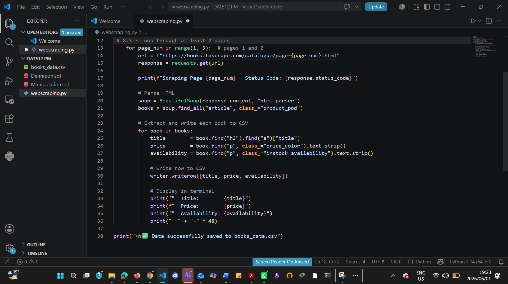
*Figure 2: Critical systems — WebServer-01 (Windows Server 2022) and Database-01 (Ubuntu Linux) both flagged Critical*

---

**Display incidents under investigation:**

```sql
SELECT * FROM Incidents WHERE status = 'Investigating';
```

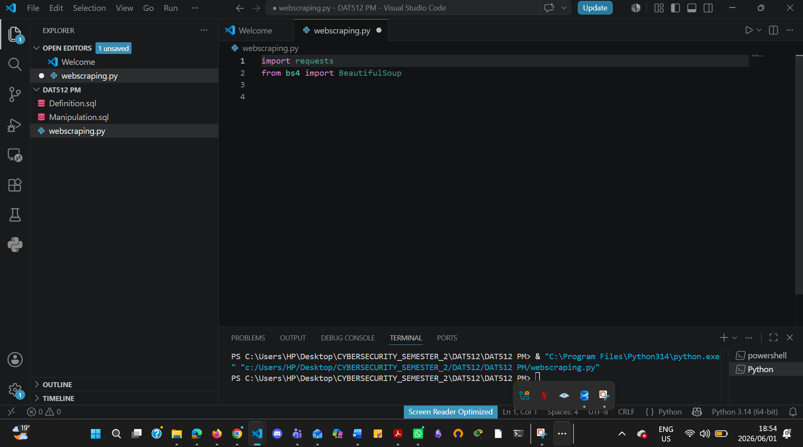
*Figure 3: Active incident — "Database Breach Attempt", Intrusion type, Critical severity, status Investigating*

---

**List active user accounts:**

```sql
SELECT * FROM Users WHERE account_status = 'Active';
```

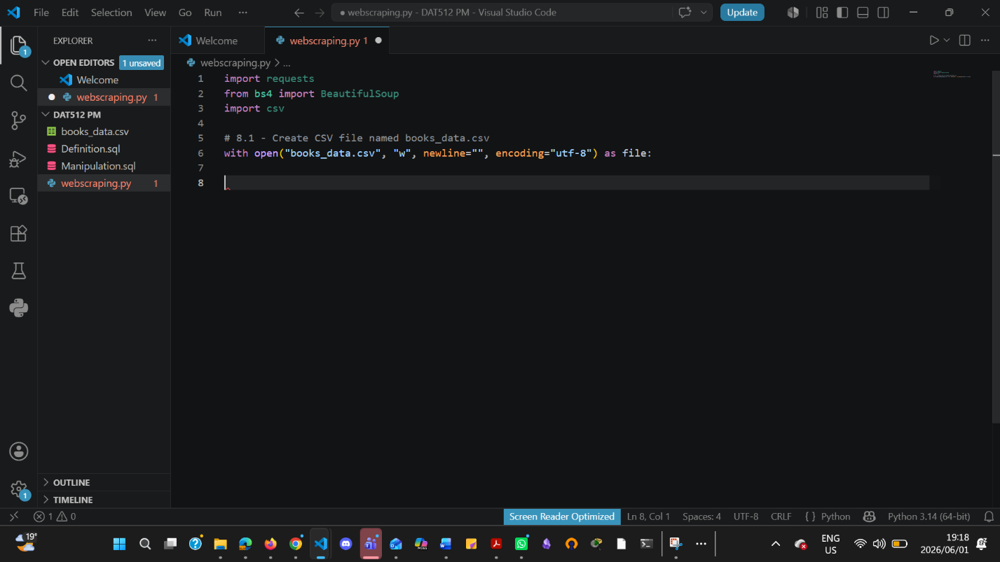
*Figure 4: Active users — nmokoena (Admin access level) and dsmith (User access level), both with HASH-stored passwords*

---

### Question 3 — JOIN Operations

**Vulnerabilities linked to affected systems:**

```sql
SELECT
    v.vulnerability_name,
    v.cve_code,
    s.system_name
FROM Vulnerabilities v
INNER JOIN Systems s
    ON v.affected_system_id = s.system_id;
```

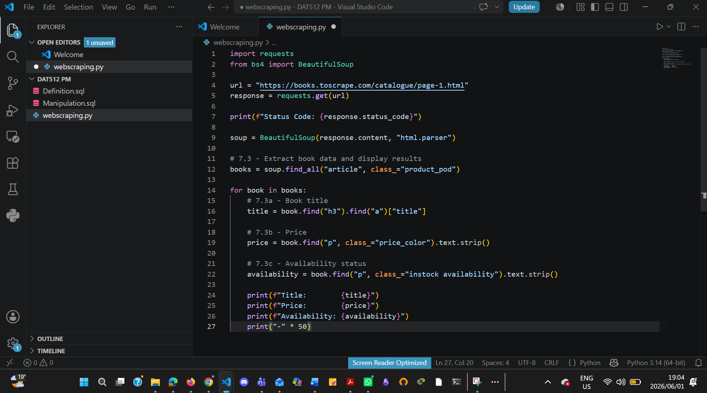
*Figure 5: JOIN result — CVE-2024-1234 (OpenSSL Exploit) mapped to Database-01; CVE-2024-5678 (Weak Password Policy) mapped to WebServer-01*

---

**Employee training certification status:**

```sql
SELECT
    e.first_name,
    e.last_name,
    st.training_name,
    st.certification_status
FROM Employees e
INNER JOIN Security_Training st
    ON e.employee_id = st.employee_id;
```

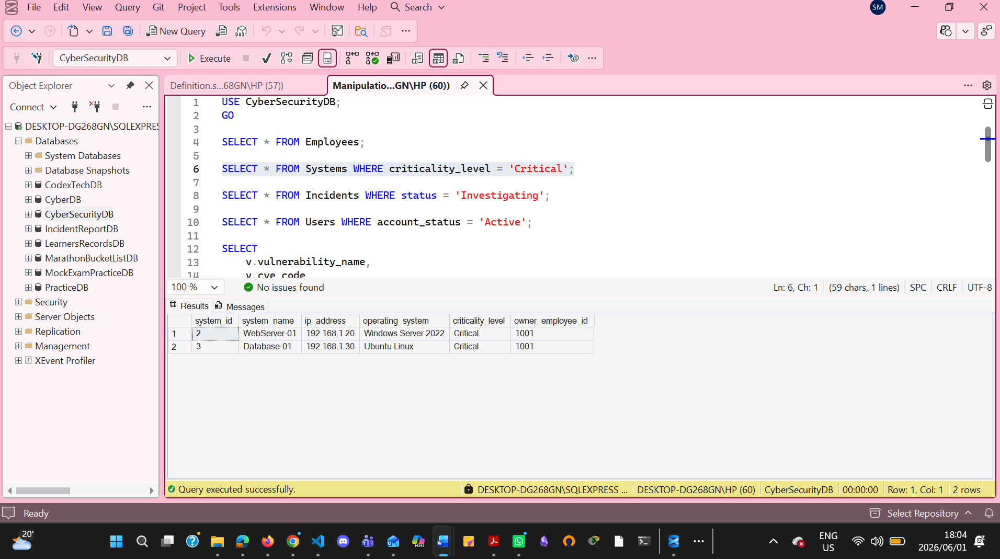
*Figure 6: JOIN result — 3 employees with training records; Norma and David Completed, Aisha Pending for ISO 27001 Compliance*

---

### Question 4 — Data Manipulation (INSERT / UPDATE / DELETE)

**INSERT — new threat record:**

```sql
INSERT INTO Threats (threat_name, threat_type, severity, description)
VALUES ('Brute Force Attack', 'Network Attack', 'High',
        'Repeated login attempts to gain unauthorised access');
```

**UPDATE — resolve an incident:**

```sql
UPDATE Incidents
SET status = 'Resolved'
WHERE incident_id = 1;
```

**DELETE — remove locked user accounts (with dependency handling):**

```sql
-- Step 1: Delete related security logs first
DELETE FROM Security_Logs
WHERE user_id = (SELECT user_id FROM Users WHERE account_status = 'Locked');

-- Step 2: Delete the locked user
DELETE FROM Users WHERE account_status = 'Locked';
```

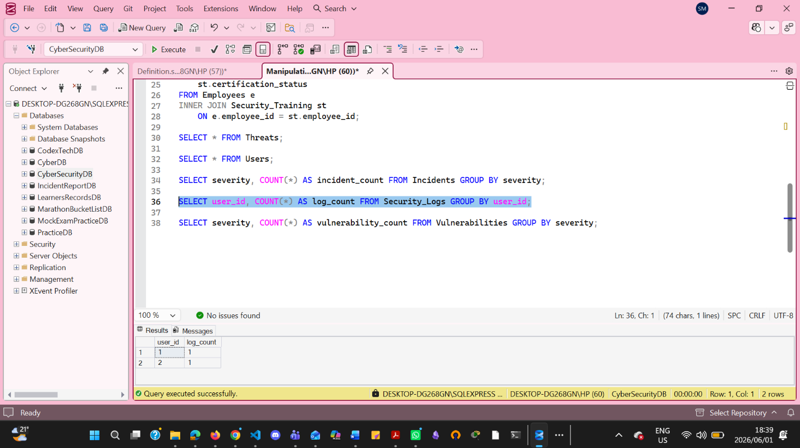
*Figure 7: DML statements — INSERT into Threats and UPDATE Incidents visible in Definition.sql*

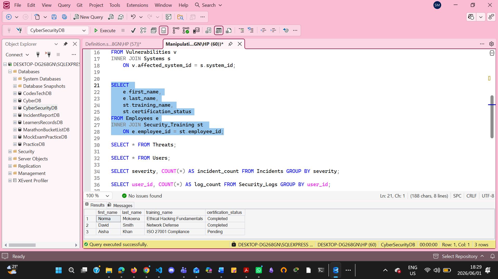
*Figure 8: DELETE logic — related Security_Logs deleted first to handle foreign key constraint before removing locked Users*

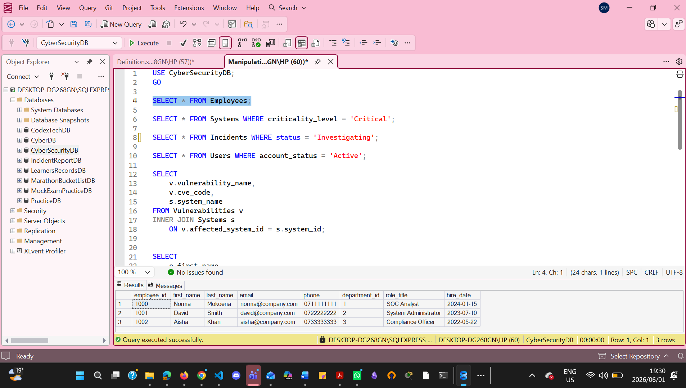
*Figure 9: DML execution results — multiple "rows affected" confirmations for INSERT, UPDATE, and DELETE operations*

---

### Question 5 — Aggregation & Analysis Queries

**Count incidents by severity:**

```sql
SELECT severity, COUNT(*) AS incident_count
FROM Incidents GROUP BY severity;
```

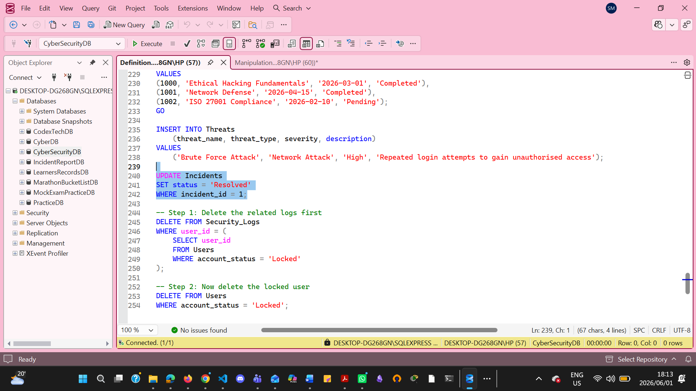
*Figure 10: Incidents by severity — Critical count: 1, Medium count: 1*

---

**Security log count per user:**

```sql
SELECT user_id, COUNT(*) AS log_count
FROM Security_Logs GROUP BY user_id;
```

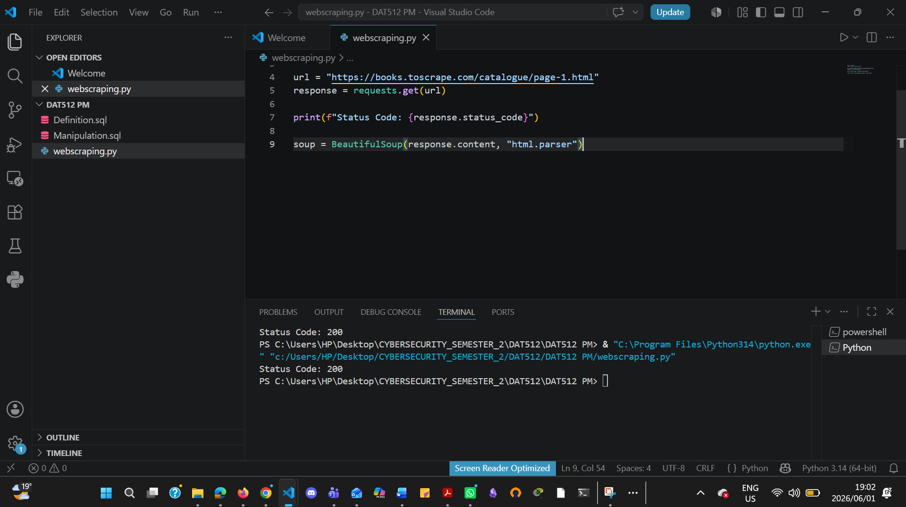
*Figure 11: Log count per user — both user_id 1 and 2 have 1 security log each*

---

**Vulnerabilities by severity:**

```sql
SELECT severity, COUNT(*) AS vulnerability_count
FROM Vulnerabilities GROUP BY severity;
```

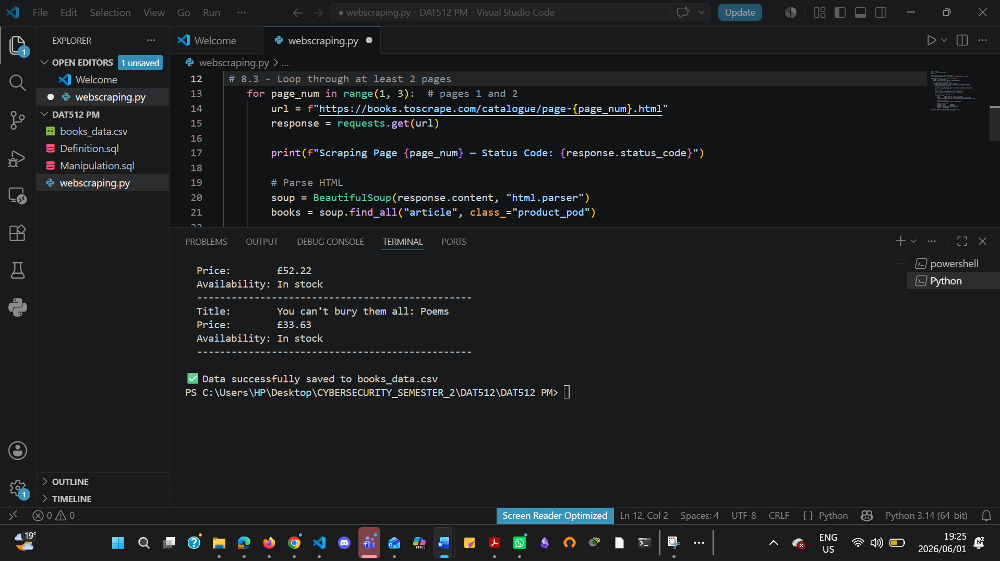
*Figure 12: Vulnerabilities by severity — Critical: 1 (OpenSSL Exploit), High: 1 (Weak Password Policy)*

---

### Security Concepts Covered

- Database structure and relational integrity (primary keys, foreign keys)
- Identifying over-privileged user accounts via access level queries
- Querying security logs for suspicious activity patterns
- Understanding how SQL injection exploits poorly sanitised queries
- Principle of least privilege applied to database user accounts

---

## Part 2 — Python Web Scraping Pipeline

### Script: `webscraping.py`

Automated data extraction script using BeautifulSoup and the `csv` module.
Scrapes book title, price, and availability across multiple pages of
[books.toscrape.com](https://books.toscrape.com) and writes structured output to CSV.

The script was built incrementally across Questions 7 and 8, progressively adding
functionality from imports through to multi-page CSV automation.

### How it works

```
HTTP GET request → HTML parsing → data extraction → CSV write → terminal output
```

---

### Question 7 — Web Scraping Implementation

**Step 1 — Import libraries:**

```python
import requests
from bs4 import BeautifulSoup
```

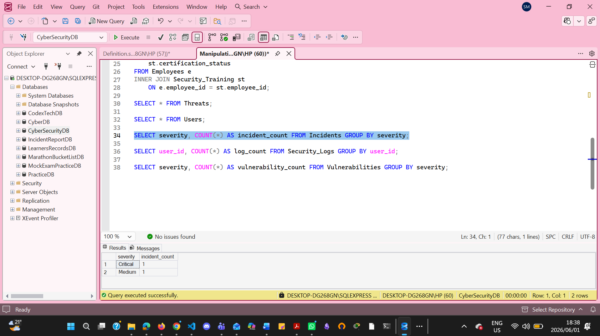
*Figure 13: Libraries imported — requests and BeautifulSoup loaded in VS Code, Python 3.14 environment*

---

**Step 2 — Send HTTP request:**

```python
url = "https://books.toscrape.com/catalogue/page-1.html"
response = requests.get(url)
```

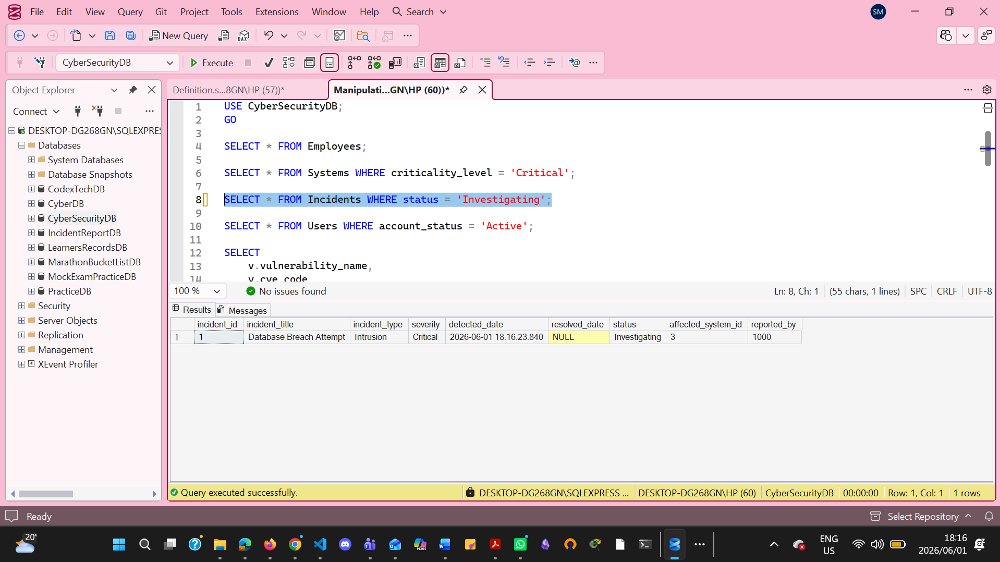
*Figure 14: HTTP GET request configured — URL set to books.toscrape.com/catalogue/page-1.html*

---

**Step 3 — Print status code:**

```python
print(f"Status Code: {response.status_code}")
```

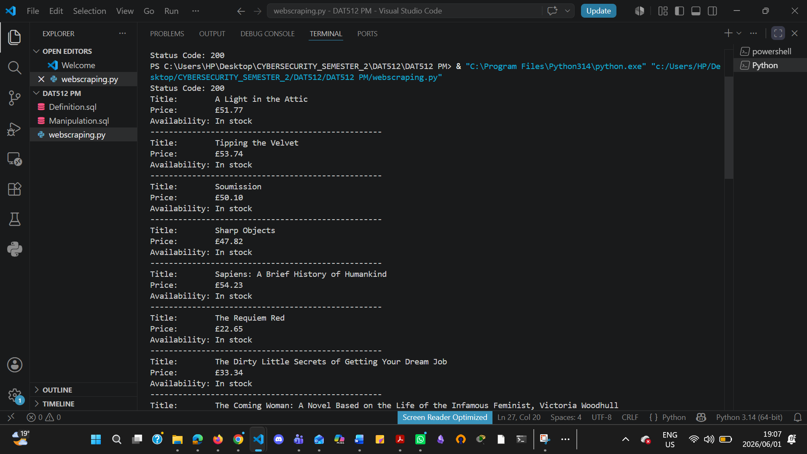
*Figure 15: Status Code 200 confirmed — successful connection to books.toscrape.com*

---

**Step 4 — Parse HTML with BeautifulSoup:**

```python
soup = BeautifulSoup(response.content, "html.parser")
```

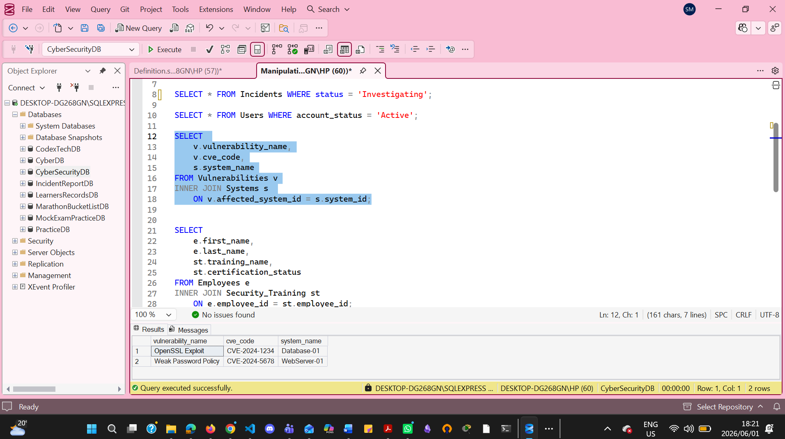
*Figure 16: HTML parsed — BeautifulSoup object created from response content using html.parser*

---

**Step 5 — Extract title, price, availability:**

```python
books = soup.find_all("article", class_="product_pod")

for book in books:
    title        = book.find("h3").find("a")["title"]
    price        = book.find("p", class_="price_color").text.strip()
    availability = book.find("p", class_="instock availability").text.strip()

    print(f"Title:        {title}")
    print(f"Price:        {price}")
    print(f"Availability: {availability}")
```

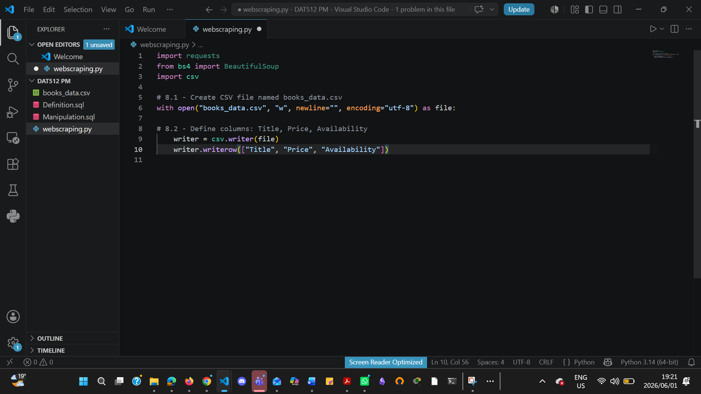
*Figure 17: Extraction logic — find_all for product_pod articles, title from h3 anchor, price from price_color class, availability from instock class*

---

**Terminal output — data extracted successfully:**

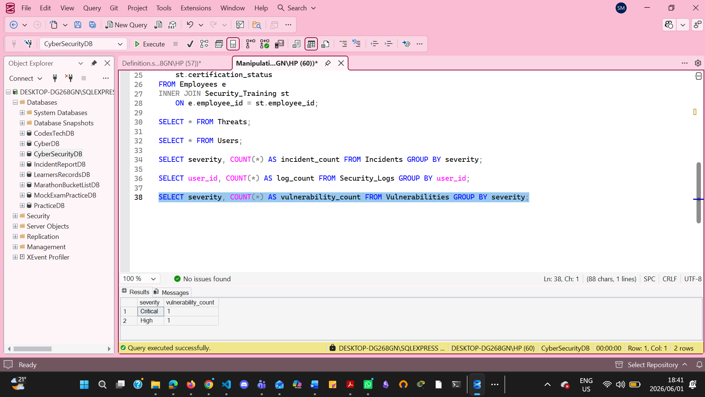
*Figure 18: Terminal output (page 2) — book titles, prices (£), and "In stock" availability printed for each book*

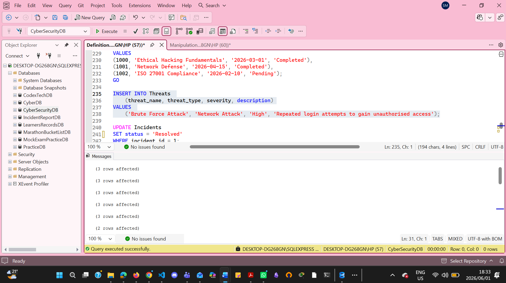
*Figure 19: Terminal output (page 1) — first books extracted: A Light in the Attic £51.77, Tipping the Velvet £53.74, all In stock*

---

### Question 8 — Data Storage & Multi-Page Automation

**Step 1 — Create CSV file:**

```python
import csv

with open("books_data.csv", "w", newline="", encoding="utf-8") as file:
```

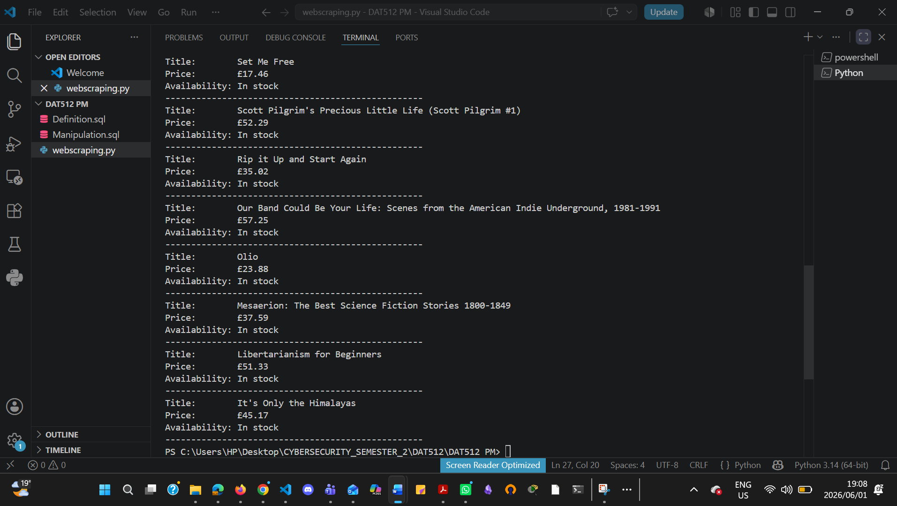
*Figure 20: CSV file created — books_data.csv appears in the DAT512 PM project folder in VS Code explorer*

---

**Step 2 — Define columns:**

```python
    writer = csv.writer(file)
    writer.writerow(["Title", "Price", "Availability"])
```

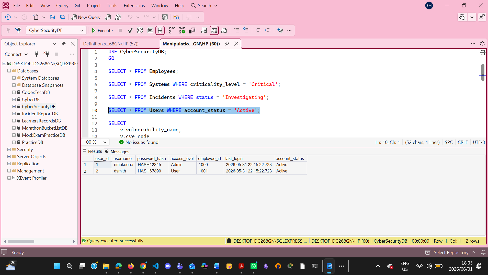
*Figure 21: CSV header row written — Title, Price, Availability columns defined*

---

**Step 3 — Multi-page loop with CSV write:**

```python
    for page_num in range(1, 3):  # pages 1 and 2
        url = f"https://books.toscrape.com/catalogue/page-{page_num}.html"
        response = requests.get(url)
        soup = BeautifulSoup(response.content, "html.parser")
        books = soup.find_all("article", class_="product_pod")

        for book in books:
            title        = book.find("h3").find("a")["title"]
            price        = book.find("p", class_="price_color").text.strip()
            availability = book.find("p", class_="instock availability").text.strip()
            writer.writerow([title, price, availability])
```

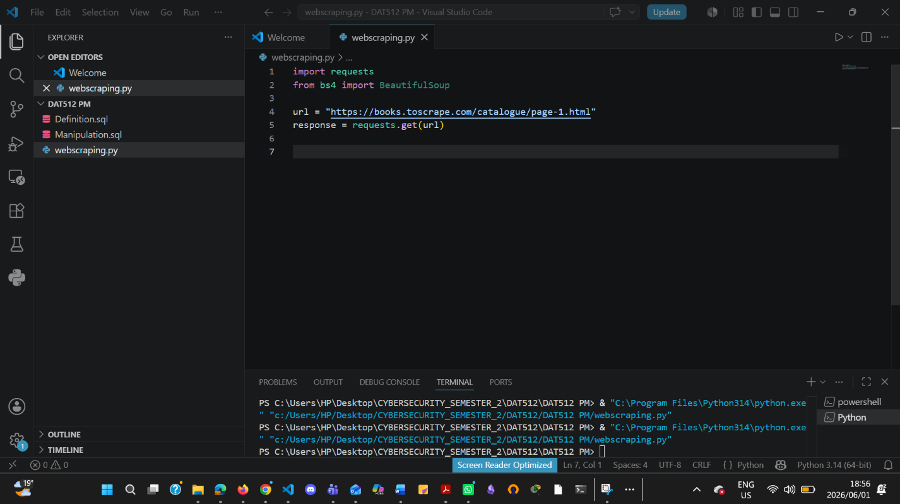
*Figure 22: Loop scraping pages 1 and 2 — terminal confirms "✅ Data successfully saved to books_data.csv"*

---

**Complete final script:**

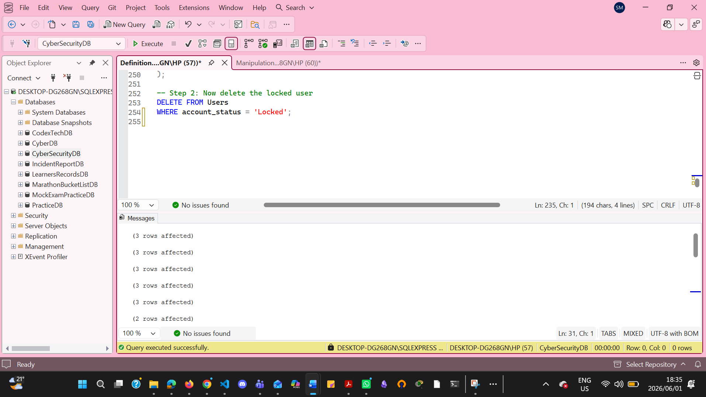
*Figure 23: Complete script — 38 lines covering imports, CSV file creation, multi-page loop, HTML parsing, data extraction, CSV write, and terminal display*

---

### Sample Output: `books_data.csv`

| Title | Price | Availability |
|-------|-------|--------------|
| A Light in the Attic | £51.77 | In stock |
| Tipping the Velvet | £53.74 | In stock |
| ... | ... | ... |

---

### Relevance to Security

Web scraping techniques are directly applicable in cybersecurity for:
- OSINT data collection and aggregation
- Automating reconnaissance tasks
- Extracting structured data from security feeds and threat intelligence sources
- Automating repetitive SOC data-gathering tasks

---

## Tools & Technologies

| Tool | Purpose |
|------|---------|
| SQL Server Management Studio (SSMS) | Database design, querying, and DML |
| Python 3 | Scripting |
| requests | HTTP GET requests |
| BeautifulSoup (bs4) | HTML parsing and data extraction |
| csv module | Structured output to CSV |
| Kali Linux WSL | Development environment |
| VS Code | Code editor |

---

## Files in This Repository

```
├── Definition.sql          # Database schema (DDL — CREATE TABLE statements)
├── Manipulation.sql        # SQL queries (SELECT, JOIN, DML, aggregation)
├── webscraping.py          # Python web scraping script
├── books_data.csv          # Sample output from scraping script
├── assets/                 # Screenshots
└── README.md
```

---

## Author

**Sindiswa Msubo**
Cybersecurity Student | Aspiring SOC Analyst
[LinkedIn](https://www.linkedin.com/in/sindiswa-msubo-1b908716a/) | [GitHub](https://github.com/Sindi298)
